# BUG-001 — Password recovery link returns HTTP 404 Not Found

**Severity:** Critical
**Priority:** P1
**Reproducibility:** Always
**Environment:** Brave 1.88.136 Chromium: 146.0.7680.164, Windows 10 Pro, Desktop

## Steps to reproduce
1. Go to the homepage
2. Click Menu then Login
3. Click "Forgot Your Password?"
4. Enter a valid email address and submit
5. Open the recovery email sent to that address
6. Click the "Set new password" link in the email

## Expected
A page opens where the user can enter and confirm a new password.

## Actual
Clicking the link returns HTTP 404 Not Found.
The password reset page does not exist or the link
is already broken by the time it arrives in the email.

## Screenshot
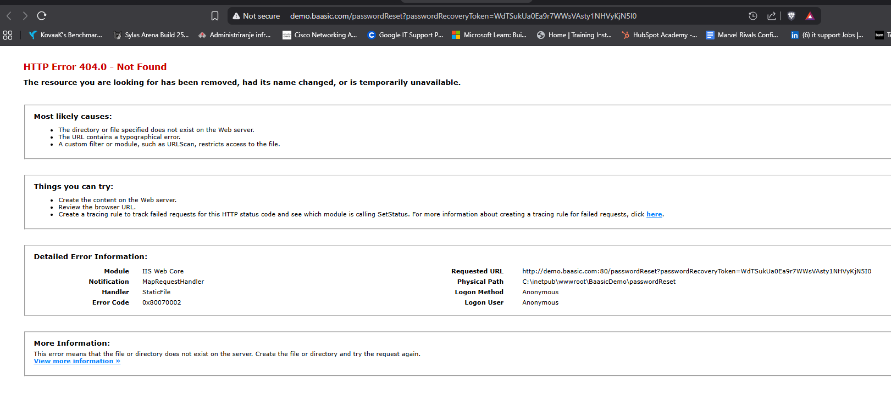

---

# BUG-002 — Footer shows placeholder text "Blog name" instead of actual site name

**Severity:** Minor
**Priority:** P3
**Reproducibility:** Always
**Environment:** Brave 1.88.136 Chromium: 146.0.7680.164, Windows 10 Pro, Desktop

## Steps to reproduce
1. Scroll to the bottom of any page
2. Look at the footer text

## Expected
Footer shows the actual application name,
e.g. "Copyright @ Baasic Photo Gallery"

## Actual
Footer shows the placeholder text "Blog name" styled
as a clickable hyperlink that leads nowhere on click.
The template default was never replaced with real content.

## Screenshot
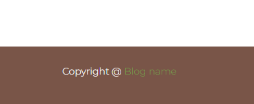

---

# BUG-003 — All four social login buttons fail with raw error message exposed to user

**Severity:** Major
**Priority:** P2
**Reproducibility:** Always
**Environment:** Brave 1.88.136 Chromium: 146.0.7680.164, Windows 10 Pro, Desktop

## Steps to reproduce
1. Go to the Login page
2. Scroll down to the Social Login section
3. Click any of the four buttons: Facebook, Twitter, Google, GitHub
4. Observe the result

## Expected
Clicking a social login button opens that platform's
login flow. If social login is not configured, the
section should be hidden and not showing raw errors.

## Actual
None of the four buttons work. A permanent red error
message sits below the icons at all times:
"undefined: Social login configuration not found."
This is an internal error message that should never
be visible to end users.

## Console errors (DevTools)
All four providers return 400 Bad Request:

GET .../login/social/twitter/?returnUrl=...   400 (Bad Request)
GET .../login/social/facebook/?returnUrl=...  400 (Bad Request)
GET .../login/social/github/?returnUrl=...    400 (Bad Request)
GET .../login/social/google/?returnUrl=...    400 (Bad Request)

Server response:
{"error": "invalid_provider_configuration", "error_description": "Social login configuration not found."}

## Screenshots
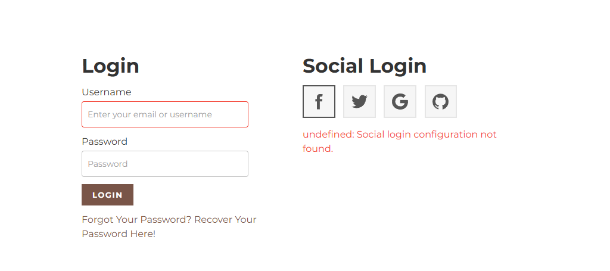

---

# BUG-004 — Photos show a different date in gallery view vs detail page, always one day ahead

**Severity:** Major
**Priority:** P2
**Reproducibility:** Always on recently uploaded photos
**Environment:** Brave 1.88.136 Chromium: 146.0.7680.164, Windows 10 Pro, Desktop

## Steps to reproduce
1. Open the gallery
2. Hover over any photo and note the date shown on the card
3. Click that same photo to open the detail page
4. Check the date shown under "More details"
5. Repeat on several photos to confirm the pattern

## Expected
The same date appears in both the gallery hover card
and the photo detail page.

## Actual
The detail page always shows a date one day ahead
of what the gallery hover card shows for the same photo.

Example 1:
- Gallery hover: 03/17/2026
- Detail page: 03/18/2026

Example 2:
- Gallery hover: 03/28/2026
- Detail page: 03/29/2026

Older photos in the gallery appear unaffected.
The issue is consistent on all recently uploaded photos.

## Root cause hypothesis
The server likely stores timestamps in UTC. The detail
page applies a timezone offset incorrectly and adds
one day. The gallery hover card handles it correctly.

## Screenshots
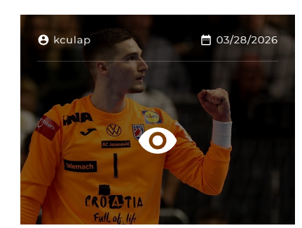
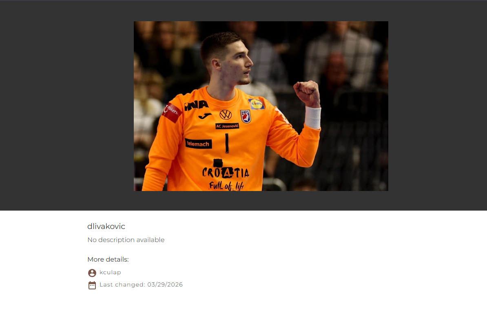

---

# BUG-005 — Registration accepts completely fake email addresses

**Severity:** Major
**Priority:** P2
**Reproducibility:** Always
**Environment:** Brave 1.88.136 Chromium: 146.0.7680.164, Windows 10 Pro, Desktop

## Steps to reproduce
1. Go to the Register page
2. Enter a fake non-existent email: ia0jdpgfpigj@fdkipoasjhnfgda.com
3. Enter any valid username: askfmnakfnmg23
4. Enter a valid password of 8 or more characters
5. Confirm the password
6. Click REGISTER

## Expected
Registration fails with a clear message like
"Please enter a valid email address."
Or at minimum the account stays inactive until
a confirmation email link is clicked.

## Actual
Registration succeeds. The app shows:
"You have successfully registered, please check
your email in order to finish registration process."
No email ever arrives because the address does not exist.
The account is created and active with no verification.

## Why this matters
Anyone can sign up with a made-up email address and
the app just lets them in. There is no way to verify
who these people are, no way to contact them, and if
they ever forget their password they are permanently
locked out. Over time the database fills up with
accounts that are essentially useless because nobody
can ever be reached at those email addresses.

## Screenshots
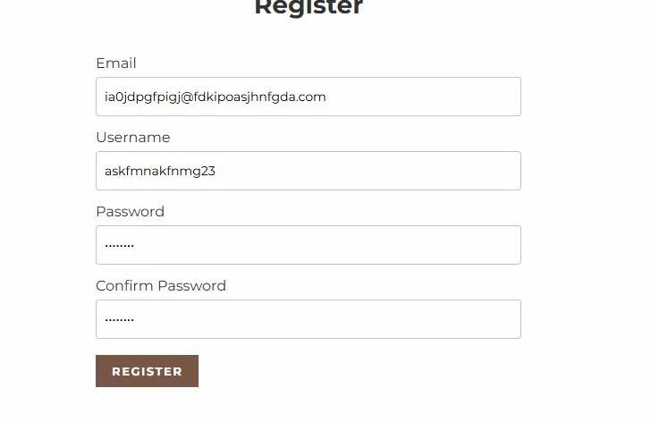
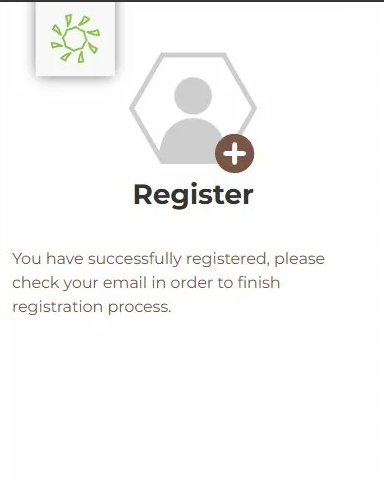

---

# BUG-006 — Some uploaded photos silently fail and return 404 when clicked

**Severity:** Critical
**Priority:** P1
**Reproducibility:** Intermittent, roughly 50% of uploads affected
**Environment:** Brave 1.88.136 Chromium: 146.0.7680.164, Windows 10 Pro, Desktop

## Steps to reproduce
1. Log in with a valid account
2. Open an album
3. Upload 4 to 5 photos one after another
4. Go back to the album view
5. Click each photo one by one
6. Note which ones open and which ones return 404

## Expected
Every uploaded photo opens correctly when clicked.

## Actual
Roughly half of uploaded photos return 404 when clicked
directly. The file never got stored on the server even
though the upload appeared to succeed and a thumbnail
is showing. Working and broken photos look completely
identical in the album view. The user has no way to
know a photo is broken until they actually try to click it.

## Console errors (DevTools)
Error 1, repeated for each broken photo:
Failed to load resource: 404 (Not Found)
api.baasic.com/v1/st.../?embed=ownerUser:1

Error 2, JavaScript crash during upload:
ERROR TypeError: Cannot read properties of
undefined (reading 'type')
at PhotoUploadComponent.previewPhoto
(photo-upload.component.ts:65:1)
at PhotoUploadComponent.ngfactory.js:240:24

## Additional note
Photos that fail on direct click can still be viewed
by navigating left and right through the album viewer.
This confirms the files do exist on the server.
The bug is specifically in how direct click loads them.
See BUG-009.

## Screenshots
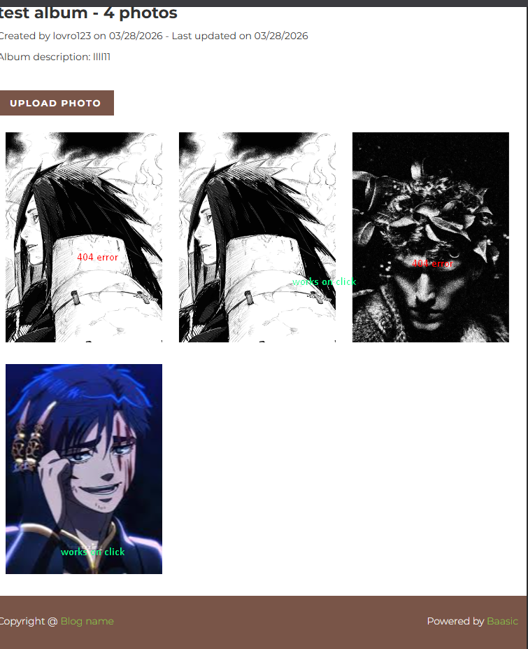
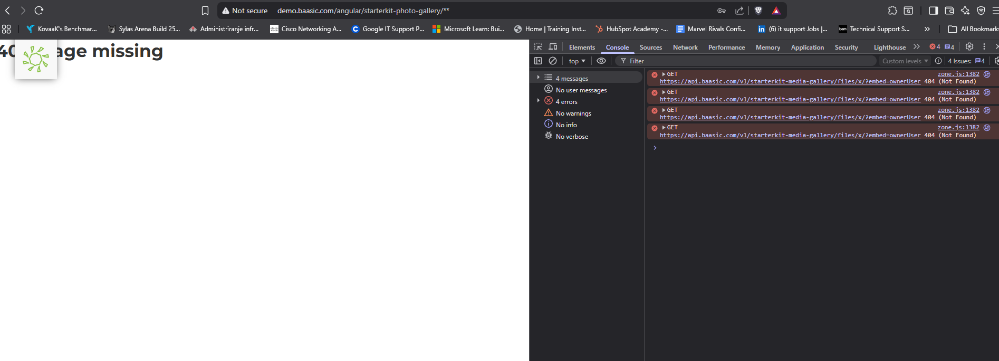

---

# BUG-007 — Album creation page shows "Created by on [date]" with username missing

**Severity:** Major
**Priority:** P2
**Reproducibility:** Always
**Environment:** Brave 1.88.136 Chromium: 146.0.7680.164, Windows 10 Pro, Desktop

## Steps to reproduce
1. Log in with a valid account
2. Create a new album and fill in the details
3. Complete the creation and land on the "Almost done!" page
4. Read the line below the album title

## Expected
"Created by lovro123 on 03/28/2026"

## Actual
"Created by on 03/28/2026"
The username is completely missing from the sentence.
The app failed to load and display the logged in
username on the album creation confirmation page.

## Screenshot
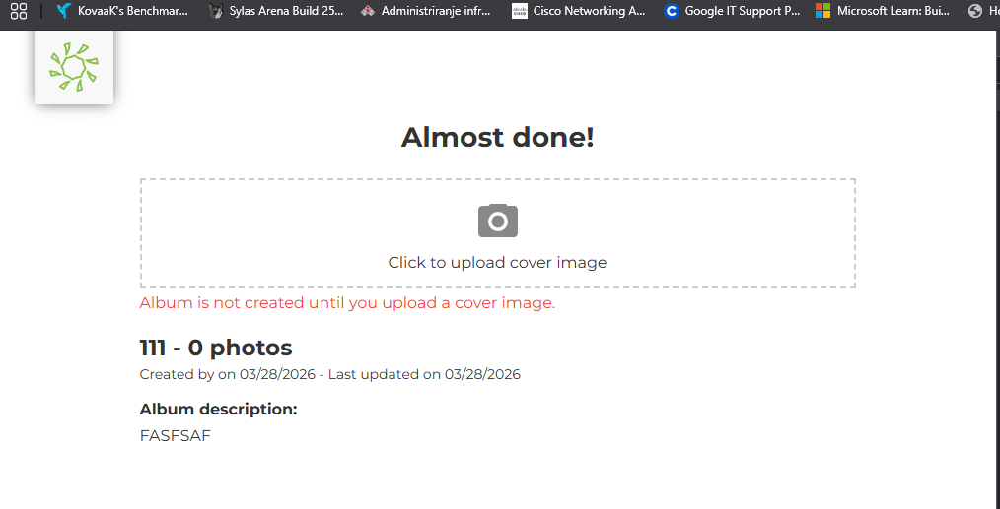

---

# BUG-008 — Album counter says "1 photos" instead of "1 photo"

**Severity:** Trivial
**Priority:** P4
**Reproducibility:** Always when album contains exactly 1 photo
**Environment:** Brave 1.88.136 Chromium: 146.0.7680.164, Windows 10 Pro, Desktop

## Steps to reproduce
1. Log in with a valid account
2. Create an album and upload exactly 1 photo
3. Go back to the Albums page
4. Read the counter text under the album thumbnail

## Expected
"test album - 1 photo"

## Actual
"test album - 1 photos"
The app uses the plural form regardless of the count.

## Screenshot
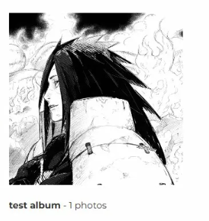

---

# BUG-009 — Photos that fail on direct click load fine via left/right navigation

**Severity:** Major
**Priority:** P2
**Reproducibility:** Always when BUG-006 is present
**Environment:** Brave 1.88.136 Chromium: 146.0.7680.164, Windows 10 Pro, Desktop

## Steps to reproduce
1. Log in with a valid account
2. Open an album that has photos returning 404 on click
3. Click any photo that opens correctly to enter the viewer
4. Use the left and right arrows to navigate to a photo
   that would normally return 404 if clicked directly
5. Observe whether it loads

## Expected
All photos open correctly regardless of how they
are accessed, whether by direct click or arrow navigation.

## Actual
Photos that return 404 on direct click load perfectly
when navigated to via the left and right arrows in the viewer.
The exact same file works one way but not the other.

## Why this matters
This is actually useful information for the developer.
It means the photos are not missing from the server at all.
They are there and loading fine through navigation.
The problem is somewhere in the code that handles
what happens when you click a photo directly from
the album grid. Two different pieces of code are doing
the same job but one of them is broken.

## Related bug
BUG-006

## Screenshot

---

# BUG-010 — Deleted photo name stays reserved and triggers 500 error on reuse

**Severity:** Critical
**Priority:** P1
**Reproducibility:** Intermittent, occurs immediately after deletion
and may resolve after some time passes
**Environment:** Brave 1.88.136 Chromium: 146.0.7680.164, Windows 10 Pro, Desktop

## Steps to reproduce
1. Log in with a valid account
2. Upload a photo and give it any name e.g. "DXYCVGV"
3. Delete that photo
4. Immediately try uploading a new photo with the same name
5. Observe the result

## Expected
Once a photo is deleted its name is freed up immediately
and can be reused without any issues.

## Actual
The app shows "Name taken, please choose another."
even though the photo was just deleted. Attempting
to upload anyway crashes the server with a
500 Internal Server Error. The error seems to go away
on its own after a while or after interacting with
other uploads, which suggests something is being
left behind in the database when a photo gets deleted
and the server chokes on it when the same name is used again.

## Why this matters
If someone deletes a photo and tries to upload a
replacement with the same name right away, they will
hit this every single time. And it is not just an
inconvenience, it is actively crashing the server.
Whatever is left behind after deletion should not
be there and it is causing real damage when someone
tries to reuse that name.

## Console errors (DevTools)
POST .../file-streams/[filename].jpg returned 500 (Internal Server Error)
Multiple 409 Conflict errors for the same filename
also visible in the Network tab at the same time.

## Screenshots
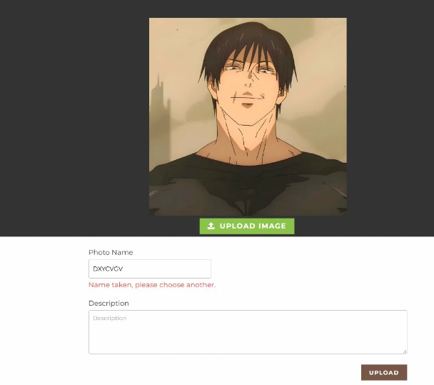
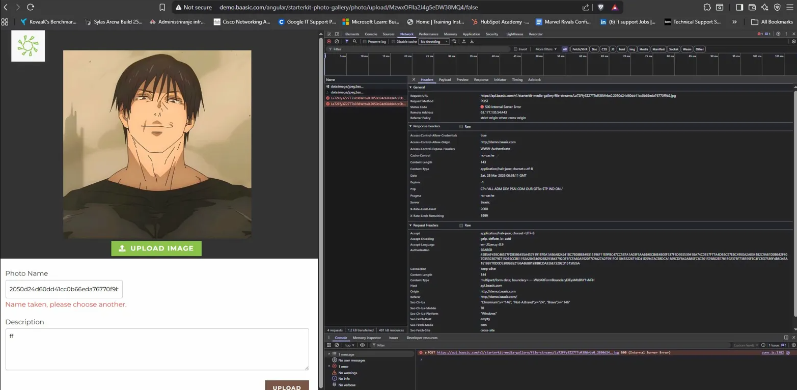                             